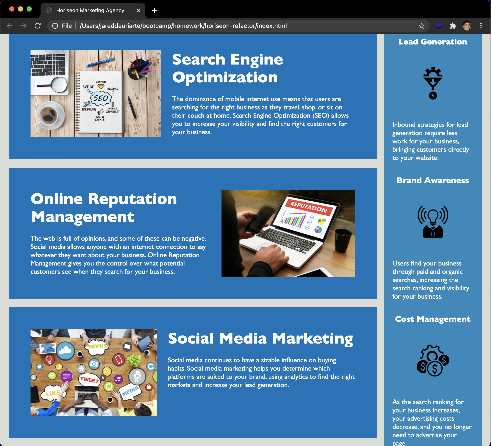

# Hori**seo**n Refactor 

## Description
In the interest of making the web application more accessible to screen readers **and** seach engine optimized, this refactor focuses on the implementing semantic HTML principles. Not only does the use of semantic HTML allow screen readers to convey semantic infomation to visually impaired individuals, the implementation of semantic HTML also optimizes a web application for top search results because of search engine algorithms.

### Method
The bulk of this project was simply swapping any < div > for a semantic html element and adding alt text to images, as well as ensuring the structure of the code followed a logical order with the use of descending heading tags and by shuffling around the style sheet. Also, since clarity seemed the general theme of this project, I included comments in the style sheet to delineate sections of the application. 

### Usage
The use of this web application is for business purposes and attracting new clients.

### Credits
I'd like to thank my steadfast bootcamp cohort for all the collaborative help getting through this first homework assigment.

### Tests
You are more than welcome to test the use of semantic HTML yourself by downloading [this](https://chrome.google.com/webstore/detail/screen-reader/kgejglhpjiefppelpmljglcjbhoiplfn/related?hl=en) Chrome extension screen reader.